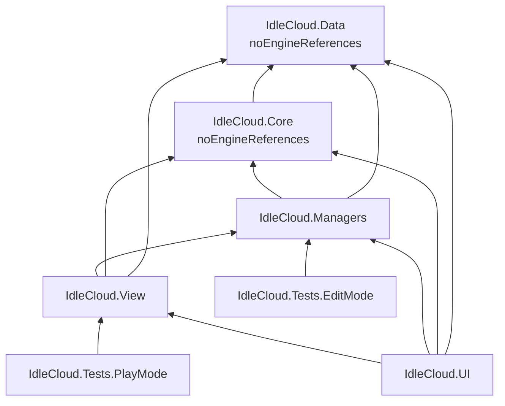

# IdleCloud Architecture Documentation

## 1. How to Read This Document

This document is the architectural map of IdleCloud for developers and AI agents. It describes what exists and why it is shaped that way — not implementation detail (read the code for that). Sections 2–7 are orientation; sections 8+ cover the game-specific subsystems. The **normative dependency rules** live in `docs/guardrails/PROJECT.md` — when this document and PROJECT.md disagree, PROJECT.md wins. Session-to-session working state lives in `docs/STATE.md`.

## 2. Overview

IdleCloud is a **2.5D top-down isometric idle RPG** (billboard sprites on an isometric tile grid) built in Unity.

The architecture is shaped by **strict downward dependency flow** — Data ← Core ← Managers ← View/UI. Presentation reads everything; nothing references presentation.

Account model: multi-character with a shared bank/currency pool, snapshot-based and deterministic (seeded randomness via `IRandomSource` / `OfflineSeed`).

## 3. Technology Stack

| Component | Version | Purpose |
|---|---|---|
| Unity Editor | 6000.5.1f1 (Unity 6) | Engine |
| Universal Render Pipeline (URP) | 17.5.0 | 2D Renderer, 2D lighting (lit sprites, normal maps) |
| Input System | 1.19.0 | Player input (click-to-move, skills) |
| Cinemachine | 3.1.7 | Camera |
| uGUI + TextMeshPro | 2.5.0 | Runtime UI |
| Newtonsoft JSON (com.unity.nuget.newtonsoft-json) | 3.2.2 | Save serialization (Managers layer) |
| Unity Test Framework | 1.7.0 | EditMode/PlayMode tests (NUnit) |
| 2D Tilemap + Extras, Pixel Perfect | 8.0.3 / 6.0.0 | Isometric tilemaps, pixel-art camera |
| SuperTiled2Unity | (asset) | Tiled map import (referenced by View assembly) |

Language: C#. Art pipeline: Pixelorama (`.pxo`) sources → sliced PNG spritesheets in `Assets/Art/`.

## 4. Project Structure

```
Assets/
├── Scripts/                  # All asmdef-owned game code
│   ├── Data/                 # IdleCloud.Data — pure models, static content repos
│   │   └── State/            # Runtime state types & contracts (GameTypes, combat/gathering contracts)
│   ├── Core/                 # IdleCloud.Core — headless game logic
│   │   ├── Combat/           # ActiveSim, AutoCombatPolicy, CircleShapeResolver, TilePatternResolver
│   │   ├── LifeSkills/       # Gathering simulation
│   │   ├── Offline/          # Snapshot validation
│   │   └── Common/           # IRandomSource, OfflineSeed, validators
│   ├── Managers/             # IdleCloud.Managers — orchestration (GameManager, SaveManager,
│   │   │                     #   GameSession, ActiveCombat/GatheringCoordinator)
│   │   └── Content/          # ContentValidator
│   ├── UI/                   # IdleCloud.UI — uGUI panels, UIBuilder, UITheme
│   ├── View/                 # IdleCloud.View — world presentation (controllers, pathfinding, scenes)
│   └── Tests/                # EditMode (10 files) + PlayMode (1 file) test assemblies
├── Iso/Sorting/              # Isometric sort/elevation system (Assembly-CSharp, deliberate — see §9)
├── Editor/                   # Editor-only tooling (Assembly-CSharp-Editor): UIBakeTool,
│                             #   SlimePrefabGenerator, WorldAssetPrefabGenerator, SceneStructureMigration
├── Art/                      # Sprites, tilesets, UI art (+ .pxo sources)
├── Prefabs/                  # Generated + hand-tuned prefabs (Enemies/, World/)
└── Scenes/                   # Bootstrap, PersistentGame, Maps/FirstMap, Scene A (legacy sandbox)
docs/                         # ARCHI.md (this file), STATE.md, guardrails/, TRIP folders (1-plans …)
```

Solution: `IdleCloud.slnx` at repo root (`.csproj` files are Unity-generated — see §6 gotcha).

## 5. Core Architecture Principles

**The principles themselves live in `docs/guardrails/PROJECT.md` — read it before writing code.** It owns: the layering borders and downward-only dependency rule (§2), the data-driven/composition style rules (§3), and the simulation philosophy. This document does not restate them; it adds only what PROJECT.md doesn't cover:

1. **Determinism** — randomness flows through `IRandomSource`/`OfflineSeed`; offline gains are reproducible from a snapshot.
2. **Content repos & validation** — static content lives in the Data repos (`ItemsRepo`, `MonstersRepo`, `MapsRepo`, `NodesRepo`, `RecipesRepo`, `TalentsRepo`, `ClassesRepo`, `OfflineBalanceRepo`), validated up-front by `ContentValidator` / `CoreValidation` / `StateInvariantValidator`.
3. **Unity-first authoring** — gameplay values are `[SerializeField]` Inspector fields, references are drag-and-drop, no `GameObject.Find` at runtime; editor tools generate/migrate prefabs idempotently and never clobber hand-tuned values.

### Assembly dependency graph



`Assets/Iso/Sorting` has **no asmdef** — it compiles into `Assembly-CSharp`, which auto-references all IdleCloud assemblies. This is deliberate (documented decision in `docs/STATE.md`): giving it an asmdef would create a circular reference with `IdleCloud.View`.

## 6. Build System & Toolchain

- **Compile check (CLI):** `dotnet build IdleCloud.slnx` — the standard verification gate for code changes. Baseline: 0 errors, a handful of pre-existing CS0618 warnings (`FindFirstObjectByType` deprecation family).
- **Gotcha:** `.csproj`/`.slnx` files are **generated by the Unity Editor** and only regenerate while the Editor is focused. A `.cs` file added while the Editor is closed may need a manual `<Compile Include=...>` entry in the owning `.csproj` (asmdef-owned projects usually glob correctly; `Assembly-CSharp.csproj` has needed hand-edits). Same class of problem as hand-authored `.meta` GUIDs.
- **Unity batch mode is typically unavailable** — the Editor is usually open and holds the project lock. Editor-side steps (prefab generation, UI bake, scene edits, Play-mode verification) are performed by the user in the live Editor and reported back.
- **Tests:** Unity Test Runner (Window → General → Test Runner). `dotnet test` does NOT execute Unity Test Framework tests (it restores and runs 0 tests) — see §14.

## 7. Configuration

- **No environment variables or config files.** Configuration is Unity-native:
  - `[SerializeField]` Inspector fields on components (tuning: speeds, radii, costs, sort bias).
  - Shared settings assets — e.g. `Assets/Iso/Sorting/IsoSortSettings.asset` (exactly **one** instance, by convention; consumed by all sort controllers).
  - Static content in Data repos (see §5.3).
- Player-facing version: `bundleVersion` in `ProjectSettings/ProjectSettings.asset` (currently `0.9.0`).

## 8. Game Loop Architecture

**The three gameplay flows (A: active combat, B: resource gathering, C: offline snapshot) are specified step-by-step in `docs/guardrails/PROJECT.md` §4 — that is the contract; it is not repeated here.**

What PROJECT.md doesn't yet name: the Managers-layer orchestration built on top — `GameSession` plus `ActiveCombatCoordinator` / `ActiveGatheringCoordinator` (`Assets/Scripts/Managers/Gameplay/`) drive the Core simulations (`ActiveSim` + `AutoCombatPolicy`, `LifeSkills`) and mediate between them and the View. Core logic is tick/timestamp-based, not frame-based; MonoBehaviours in View drive it and render results. Offline implementation notes: §12.

**Gathering & crafting (v0.7.0)**: Flow B is live in `Maps/FirstMap` — `GatheringNodeView` nodes (copper rocks from generated `Prefabs/World/Rocks/`, one choppable `Tree_0` variant) are ticked by `GatheringView`. Core reports per-swing progress on `ActiveGatheringResult` (`ActionIntervalMs`/`ActionProgress01`, deterministic; no swing time accrues while out of range) and the node renders it as a world-space bar (same runtime-sprite pattern as `CombatTargetView`'s health bar). Crafting (`Crafting` in Core) deliberately diverges from the store.ts source: materials are consumed bank-first then from the character inventory, coins are bank-only, output lands in the character inventory, and `CanCraft` dry-runs the whole transaction (including inventory capacity) so UI validation is exact.

**Ground loot (v0.8.0)**: kills no longer deposit item loot directly — `ActiveCombatCoordinator` returns per-defeated-actor `KillLootRecord`s and `LootDropManager` (`Managers/Gameplay/`, plain C#, GameManager-owned) holds runtime-only ground-loot records: spawn → bag on the mob's tile (`LootBagView` prefab instance, spawned by `CombatView`), manual pickup via bag click-targets in `PlayerController` (arrival/cancel intent signaling), auto-vacuum when `Account.AutoLoot` is on (throttled retries), tunable despawn, cleared on map travel/quit — never persisted. GameManager owns the commit path (`SpawnLoot`/`TryPickupLoot`, `SessionEventKind.LootPickedUp`) and relays lifecycle events; `LootFeedPanel` (HUD) and `CombatFeedbackView` (world popups: pickups, gathering gains, crafts via `CraftCompleted`, and "Miss" popups) subscribe. Destination rule: item loot always lands in the character inventory (gathering and offline included; AutoLoot no longer routes to bank); coins stay bank-bound. Drop tables support tertiary entries (independent per-kill chance rolls) with active/offline expected-value parity in `DropSystem`.

**Progression feedback (v0.9.0)**: the coordinators no longer discard what Core computes — `CombatReward` carries per-kill coins (`KillLootRecord.Coins`, reusing the existing roll; RNG order unchanged) and character/skill level transitions; `ActiveGatheringTickResult` carries skill level transitions. GameManager normalizes these into two events, `XpAwarded` and `LevelUp` (one event per level crossed; offline rewards excluded — `OfflineReportPanel` owns those), which UI consumes for the level-up banner and XP-bar pulse. `LootPickedUpEvent.Vacuum` distinguishes auto-vacuum from manual pickups so `CombatView`/`LootBagView` can play the fly-to-player tween only for fully-emptied vacuumed bags.

**Spatial targeting (v0.5.0)**: `CombatSpatialAdapter` (View) snapshots each actor's logical tile/floor/ground position into `CombatWorldFacts.Spatial` every tick — the only tile source Core sees (no second grid). Area skills resolve either as continuous circles (`CircleShapeResolver`) or as deterministic tile patterns (`TilePatternResolver`: anchor-first canonical ordering, ActorId tie-break, same-floor policy) selected by `SkillTargetingKind`; pattern authoring lives in `TilePatternDef` on `ClassSkillDef`, validated by `ContentValidator`. Core emits `AreaResolved` (circle) / `TileAreaResolved` (ordered tiles, spatial-only — damage events stay authoritative) and `CombatFeedbackView` renders them, converting tiles back to world via `GridPathfinder.TryGetTileWorldPosition`. The offline slot-order approximation (`Activity.cs`) includes tile skills with a conservative density-capped expected-target estimate.

## 9. Isometric Rendering, Sorting & Elevation

> ** PROTECTED SYSTEM — do not adjust lightly to fix a bug.** This sorting system is deliberate, purpose-built design, not standard Unity sorting, and not a tuning surface. The sort formula, `elevationSortWeight`, `sortScale`, the shared `IsoSortSettings` asset, 
and the sort-controller logic cannot be changed to fix a visual symptom (wrong draw order, clipping, flicker) without the system itself requires an **explicit, specific user instruction to change the sorting system**, and that decision gets recorded in `docs/STATE.md` (as every past formula change was).

The most project-specific subsystem (`Assets/Iso/Sorting/`):

- World is an **isometric Unity Grid** (cell 0.64 × 0.32, `cellLayout: Isometric`) with per-floor tilemaps ("Floor N"); `TerrainVisualBuilder` clones tiles into individually-sorted block visuals and exposes per-cell height (`ITerrainHeightProvider` → `TerrainHeightService`, per-column MAX floor index).
- **Sort formula:** `S = avg(-(groundX + groundY)) + height * elevationSortWeight` (weight 2.5, `sortScale` 1000, plus small tie-breakers like the player's `sortingBias`). Applied through `IsoTerrainSortCalculator` + the single shared `IsoSortSettings` asset. URP transparency sort: Custom Axis.
- Every sortable actor has a `SortingGroup` + a sort controller: `PlayerSortController`, `EnemySortController`, `WorldObjectSortController` (static objects, `[ExecuteAlways]`, snaps to cell centers), `LootBagSortController` (reads `LootBagView.LogicalPosition`, mirrors the enemy bridge) — each tracks a logical `(groundX, groundY, height)` position, distinct from the raw transform.
- Rendering is URP **2D lit**: sprites use the Lit Sprite material + `_NormalMap` textures; `ProjectedSpriteShadow` fakes cast shadows; `SunOrbitController` animates the light.
- Ground-truth constants (ZStep, pivot/offset values) are recorded in project memory and STATE.md — do not re-derive them.

## 10. Pathfinding & World Interaction

- `GridPathfinder` (View): A* over walkable grid columns, **height-aware** — max 1 height-level per step (`maxHeightStepPerMove`), occlusion coverage (`IsStandable` rejects cells buried under taller neighbors), and 2-cell "climb" moves across 1-level cliff faces (cardinal + diagonal, costed ~2 steps).
- Click-to-move: `PlayerController` holds a logical position (`_logical`, XY = ground cell, Z = height) and walks waypoint lists; `EnemyController` wanders tile-constrained through the same pathfinder; `TileOccupancy` (static registry) prevents two mobs settling on one cell (destination-only claim).
- `SceneBootstrap` creates and wires runtime services (`GridPathfinder`) into placed actors deterministically (Start-order safe).

## 11. Scene Architecture

Three-scene additive hierarchy (see `docs/world-scene-structure.md`):

| Scene | Owns |
|---|---|
| `Bootstrap.unity` | Only the loader (`SceneLoader`) — entry point |
| `PersistentGame.unity` | `_GameManager`, cameras, `GameUI`, Player, the **sole EventSystem** |
| `Maps/FirstMap.unity` | Map content (terrain, mobs, spawn points via `MapSpawnPoint`, `WorldMapContext`) |

FirstMap is the authoring template for future maps; map scenes must never add a second EventSystem. `Scene A.unity` is the legacy sandbox still used for verification of older tasks.

**Known deviation (v0.2.0, open item)**: the baked `GameUI` instance currently sits in `Maps/FirstMap.unity` instead of `PersistentGame.unity` (wrong active scene during the bake; release accepted as-is) — the UI unloads on map travel until the instance is moved. See `docs/STATE.md`.

## 12. Offline Snapshot Simulation

**The flow contract is `docs/guardrails/PROJECT.md` §4 Flow C.** Implementation mapping: `Offline.cs` (Core) evaluates snapshot stats to fixed rates; `DropSystem` does the statistical bulk-rolls; `OfflineBalanceRepo` holds tuning; `SnapshotValidation` + `OfflineSeed` keep it deterministic; `OfflineReportPanel` (UI) displays the result.

## 13. UI Architecture

- uGUI + TextMeshPro, Screen Space – Overlay, CanvasScaler Scale-With-Screen-Size (1920×1080 ref). HUD is zoom-independent by design; `MainHudPanel` re-clamps its width to `min(HudWidth, canvas width)` when the canvas width changes (narrow-aspect safety).
- Panels (`TitlePanel`, `CharacterSelect/CreatePanel`, `MainHudPanel`, `InventoryPanel`, `EquipmentPanel`, `BankPanel`, `ActivityPanel`, `TravelPanel`, `CraftingPanel`, `TalentsPanel`, `OfflineReportPanel`, `LootFeedPanel` — a top-right fading feed for loot/craft/gathering gains and warnings, `LevelUpBannerPanel` — queued screen-center gold level-up banners whose root stays always-active and hides via CanvasGroup alpha) are plain components wired by `UIBuilder`/`UIBootstrapper`; `GameFlowController` sequences title → character select → game. Every sub-panel has a HUD nav button (eight text buttons + Auto-combat and AutoLoot toggles + the skill bar). `MainHudPanel` pulses its XP bar on `GameManager.XpAwarded`.
- **The Editor owns the layout**: UI is baked into `GameUI.prefab` via the `UIBakeTool` editor menu (`IdleCloud > UI > Bake UI Prefab`); `UIBuilder` code is the generator, the prefab is the artifact. After UI code changes: rebake **with `PersistentGame.unity` as the active scene**, save scene, Play. The runtime fallback (`UIBuilder.Bootstrap`) is deferred behind `SceneLoader.InitialLoadCompleted` and only builds when no `UIBootstrapper` exists — the baked prefab is authoritative.
- `UITheme` is **procedural-only** (v0.2.0): palette, generated 9-slice frames, two pixel fonts from `Resources/UI/Fonts` — no PNG art is loaded by UI code (art files remain in `Assets/Art/UI/` for a future reskin). `UITheme.Layout` holds all layout constants; `UIHelpers.CreateButton` et al. are the widget factory layer.

## 14. Testing Strategy

- **EditMode tests** (`Assets/Scripts/Tests/EditMode`, asmdef `IdleCloud.Tests.EditMode`): the main suite — 11 files covering Core/Managers logic (ActiveSim, AutoCombatPolicy, coordinators, drops/activity, ground-loot transactions, life skills, progression/offline, save compatibility, state/content validation). Possible because Core/Data are engine-free.
- **PlayMode tests** (`IdleCloud.Tests.PlayMode`): 1 smoke test (`GameplayLoopSmokeTests`). Deliberately references View but **not UI** — do not add UI references to test asmdefs; resolve components reflectively if needed (recorded failed attempts in STATE.md).
- **Execution:** Unity Editor Test Runner only. `dotnet test` restores but runs 0 tests. CLI gate = `dotnet build IdleCloud.slnx` compiles clean.
- **Manual Play-mode verification** is a first-class step: changes touching scenes/prefabs/sorting stay `EDITED-UNVERIFIED` until the user confirms in the Editor (see `docs/guardrails/VERIFY.md`).

## 15. Save System & Persistence

- `SaveManager` (Managers) serializes account/character snapshots with Newtonsoft JSON — the only layer that touches serialization.
- Multi-character account with shared bank (`Account`, `AccountData` state types); save-format compatibility is tested (`SaveCompatibilityTests`) and migration notes live in `docs/save-migration.md`.

## 16. Editor Tooling

`Assets/Editor/` (plus `Assets/Iso/Sorting/Editor/`) — all generators follow the same contract: **idempotent, migrate-in-place, never overwrite hand-tuned serialized values** (wire only empty fields, via `SerializedObject`/`PrefabUtility.LoadPrefabContents`):

- `UIBakeTool` — bakes UIBuilder output into `GameUI.prefab`; aborts on any unmapped runtime reference or persistent sprite/font outside `Assets/Art/UI/Generated/` (no-art regression gate).
- `SlimePrefabGenerator` — builds/migrates `Prefabs/Enemies/Slime.prefab`.
- `WorldAssetPrefabGenerator` — EditorWindow; builds `Tree_Base.prefab` + per-sprite variants with dry-run preview.
- `SceneStructureMigration`, `WorldAuthoringInspectors` — scene-split migration and authoring QoL.

## 17. Error Handling Strategy

- Content and state integrity are validated up-front (`ContentValidator`, `CoreValidation`, `StateInvariantValidator`, `SnapshotValidation`) rather than defensively at each use site.
- View-layer services fail soft and self-heal (e.g. pathfinder re-resolution, unreachable path → stay idle) instead of throwing during play.
- Editor tools report via Console logs and on-screen reports; they refuse destructive overwrites by default.

## 18. Performance Considerations

- Offline rewards are O(loot-table), not O(kills) — bulk statistical rolls by design.
- Core is allocation-light pure C#; per-frame work in View is limited to sort recomputes (`LateUpdate`) and movement.
- Pixel Perfect camera + sprite atlasing for 2D rendering; sorting uses integer orders spaced by `sortScale` to avoid churn.

## 19. Deployment

No build pipeline exists yet (pre-release; version: see §7). Standard Unity player builds via File → Build Profiles when the time comes; no CI.

## 20. Conclusion

IdleCloud's architecture is defined by two hard walls: the **engine-free Core/Data assemblies** (deterministic, testable idle-game math) and the **one-way dependency flow** enforced by asmdefs (presentation reads, never is read). Everything else — snapshot offline rewards, the isometric sort/elevation system, editor-baked UI, idempotent prefab generators — hangs off those walls. When extending the game: put rules in Core, content in Data repos, orchestration in Managers, rendering in View/UI, and let the Unity Editor own layout and tuning.
